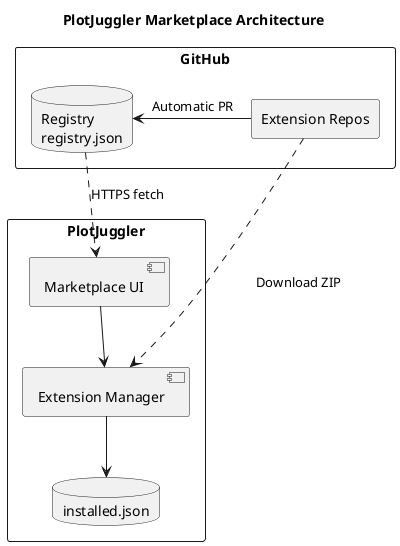
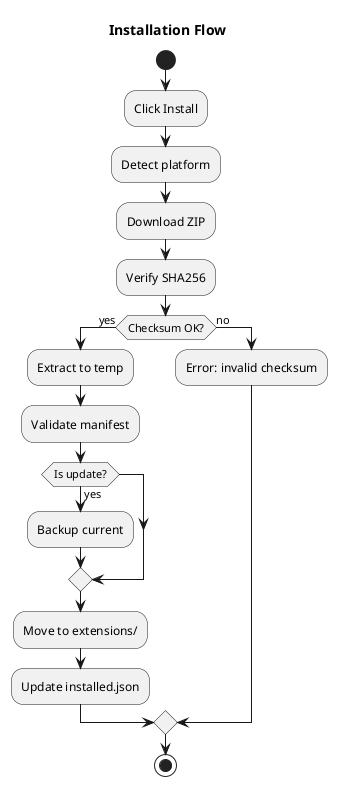
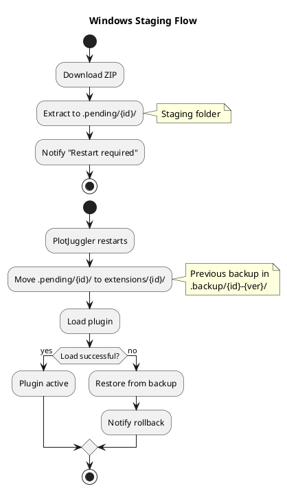
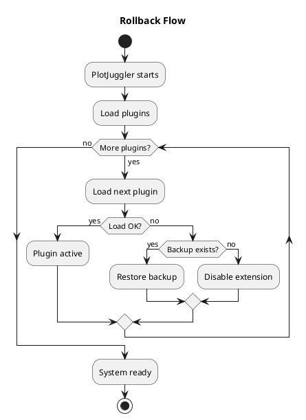

# PlotJuggler Marketplace — Architecture

> **Version:** 1.0.0
> **Last Updated:** 2026-03-04
> **Purpose:** Document HOW the system is designed and built

---

## 1. System Overview

### 1.1 High-Level Architecture


<details>
<summary>PlantUML source</summary>


</details>

### 1.2 Design Principles

| Principle | Rationale | Implementation |
|-----------|-----------|----------------|
| **Serverless** | Zero infrastructure costs | GitHub hosts everything |
| **CI-first** | Lower barrier for developers | Template with automated release |
| **Cross-platform** | PlotJuggler runs everywhere | Matrix build in CI |
| **Static linking** | Avoid dependency hell | Single .so/.dll per plugin |
| **Zero Qt in plugins** | ABI stability | Plugins use abstract SDK |
| **Dogfooding** | Ensure process works | Official plugins use same template |

---

## 2. Design Decisions

### 2.1 PlotJuggler Integration

Two approaches were considered: create an external plugin management tool (like `pip` or `npm`) or integrate it directly into PlotJuggler. The decision was clear: **native integration**.

The reasoning is that the typical PlotJuggler user doesn't want to leave the application to install plugins. They want to open a window inside PlotJuggler, search for what they need, install it, and keep working. It's the VSCode experience, not managing packages from a terminal.

That said, development will begin with a **standalone prototype**. This allows rapid iteration without touching PlotJuggler's code, and validates that the concept works before committing to the architecture. Once validated, it will integrate as native functionality in PlotJuggler 4.

### 2.2 Plugin Template as Product

A key insight is that **the barrier to creating plugins is too high**. Configuring CMake, Conan, cross-platform CI... that's days of work before writing a single line of plugin code.

The solution is a **GitHub Template** that developers use as a starting point. They click "Use this template", clone the repo, and have:

- Preconfigured CI that compiles for Linux, Windows, and macOS
- Working Conan build system
- Project structure with examples
- Release workflow: creating a `v1.0.0` tag automatically triggers compilation, packaging, and publishing

The goal is that a developer with C++ experience can have their first plugin published in the marketplace **in a day**, not a week.

### 2.3 Build System: Conan, Pixi, and the Future

The C++ ecosystem has multiple dependency managers, and PlotJuggler has used several over time:

| Tool       | Status            | Context                                                                                                    |
| ---------- | ----------------- | ---------------------------------------------------------------------------------------------------------- |
| **CMake**  | Stable            | It's the de facto standard. No reason to change it.                                                        |
| **Conan**  | Active            | Works well, has good commercial support (JFrog), and the team has experience.                              |
| **Pixi**   | Under observation | It's gaining traction in the ROS community. Offers reproducible environments similar to conda but lighter. |
| **Colcon** | Abandoned         | Was necessary for ROS 1/2 integration, but added unnecessary complexity outside that context.              |

The current decision is to **use Conan for the plugin template**, but design the system so that generated artifacts are independent of the build tool. A ZIP with a `.so` and a `manifest.json` works the same whether it was generated with Conan, Pixi, or manual compilation.

**Pixi timeline:**
1. **Short term:** Template uses Conan (already works, already tested)
2. **Medium term:** Add Pixi support as an alternative in the template
3. **Long term:** Evaluate if Pixi can replace Conan based on community adoption

The important thing is that this decision **doesn't affect marketplace users**. They just see plugins that install with one click.

### 2.4 Sizing

The system is designed for a modest catalog:

- **Current plugins:** ~20
- **Expected short-term:** ~30
- **Maximum estimate:** 40-50

This means a simple JSON file is more than sufficient as a registry. We don't need a database, we don't need sophisticated search. A JSON with 50 entries loads in milliseconds.

---

## 3. Component Design

### 3.1 Core Components

```
marketplace/
├── CMakeLists.txt
├── main.cpp
├── src/
│   ├── models/
│   │   ├── Extension.h           # Extension metadata struct
│   │   ├── InstalledExtension.h  # Local installation info
│   │   └── Registry.h            # Full registry model
│   ├── core/
│   │   ├── RegistryManager.h/cpp # Fetch, parse, cache registry
│   │   ├── ExtensionManager.h/cpp # Install, uninstall, update
│   │   ├── DownloadManager.h/cpp  # HTTP download with progress
│   │   └── PlatformUtils.h/cpp    # OS detection, paths
│   ├── ui/
│   │   ├── MarketplaceWindow.h/cpp       # Main window/dialog
│   │   ├── ExtensionListWidget.h/cpp     # Extension list (table or list)
│   │   ├── ExtensionDetailDialog.h/cpp   # Detail dialog (Approach A - POC)
│   │   ├── ExtensionDetailWidget.h/cpp   # Detail panel (Approach B - future)
│   │   └── StatusBarManager.h/cpp        # Progress/status
│   └── utils/
│       ├── ChecksumVerifier.h/cpp # SHA256 verification
│       └── ZipExtractor.h/cpp     # ZIP decompression
└── resources/
    ├── icons/
    └── marketplace.qrc
```

### 3.2 Data Models

#### Extension.h
```cpp
struct Extension {
    QString id;
    QString name;
    QString description;
    QString author;
    QString publisher;
    QString license;
    QString category;        // data_loader, data_streamer, parser, toolbox
    QStringList tags;
    QString version;
    QString min_plotjuggler_version;

    struct Platform {
        QString url;
        QString checksum;     // sha256:...
    };
    QMap<QString, Platform> platforms;  // linux-x86_64, windows-x86_64, etc.

    QMap<QString, QString> changelog;   // version -> description
};
```

#### InstalledExtension.h
```cpp
struct InstalledExtension {
    QString id;
    QString version;
    QDateTime install_date;
    QString path;
    bool enabled;
    QString backup_path;      // Optional
};
```

### 3.3 Component Responsibilities

| Component | Responsibility | Dependencies |
|-----------|---------------|--------------|
| **RegistryManager** | Fetch JSON, parse, cache with TTL | QNetworkAccessManager |
| **ExtensionManager** | Install, uninstall, update, rollback | DownloadManager, ZipExtractor, PlatformUtils |
| **DownloadManager** | HTTP GET with progress signals | QNetworkAccessManager |
| **ChecksumVerifier** | SHA256 verification | QCryptographicHash |
| **ZipExtractor** | Extract ZIP to directory | QuaZip/minizip |
| **PlatformUtils** | Detect OS, get paths | Qt platform macros |

#### ExtensionManager — Constructor Design

All dependencies are injected via constructor. The extensions directory defaults to
`PlatformUtils::extensionsDir()`, allowing tests to point to a temp directory without
mocking `PlatformUtils`:

```cpp
ExtensionManager(DownloadManager* downloader,
                 ZipExtractor* extractor,
                 const QString& extensions_dir = PlatformUtils::extensionsDir(),
                 QObject* parent = nullptr);
```

**Design decisions:**
- No `setExtensionsDir()` public setter — directory is fixed at construction time
- No `detectPlatform()` private method — delegated to `PlatformUtils::currentPlatform()`
- `ZipExtractor` is an explicit constructor dependency, not created internally
- Local installation state (`QMap<QString, InstalledExtension>`) is a private member of `ExtensionManager` — loaded from `extensions_dir/installed.json` at construction via private `loadState()`/`saveState()` methods; testability is preserved via the `extensions_dir` parameter pointing to a temp directory

---

## 4. Key Flows

### 4.1 Installation Flow


<details>
<summary>PlantUML source</summary>


</details>

### 4.2 Windows Staging Flow


<details>
<summary>PlantUML source</summary>


</details>

### 4.3 Rollback Flow


<details>
<summary>PlantUML source</summary>


</details>

---

## 5. Directory Structure

### 5.1 Installation Directories

```
~/.plotjuggler/
├── extensions/              # Active plugins
│   ├── ros2-streaming/
│   │   ├── manifest.json
│   │   ├── libros2_streaming.so
│   │   └── ros2_streaming.ui
│   └── csv-loader/
│       ├── manifest.json
│       └── libcsv_loader.so
├── .pending/                # Staging area (Windows)
│   └── ros2-streaming/      # Ready to install on restart
├── .backup/                 # Rollback backups
│   ├── ros2-streaming-1.2.2/
│   └── csv-loader-0.9.0/
├── .cache/                  # Registry cache
│   └── registry.json
└── installed.json           # Local state
```

### 5.2 Extension ZIP Structure

```
ros2-streaming-linux-x86_64.zip
├── manifest.json              # Required: extension metadata
├── libros2_streaming.so       # Required: compiled plugin(s)
├── ros2_streaming.ui          # Optional: Qt Creator UI file
├── README.md                  # Optional: description
└── LICENSE                    # Required: license file
```

---

## 6. ABI Compatibility Strategy

### 6.1 The Problem

Binary compatibility (ABI) is the biggest technical challenge:

1. User installs plugin compiled with Qt 5.15.2
2. User updates PlotJuggler to Qt 6.2
3. Plugin crashes due to Qt internal structure changes

### 6.2 The Solution: Zero Qt in Plugins

```
┌─────────────────────────────────────────────────────────────────────┐
│                         PLOTJUGGLER                                  │
│                                                                      │
│  ┌────────────────┐         ┌────────────────┐                      │
│  │   Qt Widgets   │         │  Plugin SDK    │                      │
│  │   (Qt 6.x)     │◄───────►│  (Abstract)    │                      │
│  └────────────────┘         └───────┬────────┘                      │
│                                     │                                │
│  ┌────────────────┐                 │                                │
│  │  .ui file      │─────────────────┤                                │
│  │  (pure XML)    │                 │                                │
│  └────────────────┘                 │                                │
└─────────────────────────────────────┼────────────────────────────────┘
                                      │
                                      │ SDK Interface (stable)
                                      │
┌─────────────────────────────────────┼────────────────────────────────┐
│                         PLUGIN                                       │
│                                     │                                │
│  ┌────────────────┐         ┌───────┴────────┐                      │
│  │  Plugin Code   │◄───────►│  SDK Headers   │                      │
│  │  (C++17)       │         │  (No Qt!)      │                      │
│  └────────────────┘         └────────────────┘                      │
│                                                                      │
│  NO Qt dependency = NO ABI breaks when PJ updates Qt                │
└─────────────────────────────────────────────────────────────────────┘
```

### 6.3 Compatibility Policy

- Each plugin declares `min_plotjuggler_version` in manifest
- If SDK changes incompatibly, PlotJuggler provides internal adapter
- **Existing plugins are never broken by PlotJuggler updates**
- Stability target: Qt LTS 6.8 (support until 2028)

---

## 7. Build System

### 7.1 CMakeLists.txt (Marketplace)

```cmake
cmake_minimum_required(VERSION 3.16)
project(pj_marketplace VERSION 1.0.0 LANGUAGES CXX)

set(CMAKE_CXX_STANDARD 17)
set(CMAKE_CXX_STANDARD_REQUIRED ON)
set(CMAKE_AUTOMOC ON)
set(CMAKE_AUTORCC ON)
set(CMAKE_AUTOUIC ON)

find_package(Qt6 REQUIRED COMPONENTS Widgets Network)
find_package(QuaZip-Qt6 REQUIRED)  # Or alternative ZIP library

add_library(pj_marketplace SHARED
    src/models/Extension.cpp
    src/core/RegistryManager.cpp
    src/core/ExtensionManager.cpp
    src/core/DownloadManager.cpp
    src/core/PlatformUtils.cpp
    src/ui/MarketplaceWindow.cpp
    src/ui/ExtensionListWidget.cpp
    src/ui/ExtensionCardDelegate.cpp
    src/ui/ExtensionDetailWidget.cpp
    src/utils/ChecksumVerifier.cpp
    src/utils/ZipExtractor.cpp
    resources/marketplace.qrc
)

target_link_libraries(pj_marketplace PRIVATE
    Qt6::Widgets
    Qt6::Network
    QuaZip::QuaZip
)

target_include_directories(pj_marketplace PUBLIC
    ${CMAKE_CURRENT_SOURCE_DIR}/src
)
```

### 7.2 Dummy Plugin CMakeLists.txt (POC)

For the POC phase, dummy plugins are extremely simple — no Qt, no SDK, just pure C++:

```cmake
cmake_minimum_required(VERSION 3.16)
project(dummy_extension VERSION 1.0.0 LANGUAGES CXX)

set(CMAKE_CXX_STANDARD 17)
set(CMAKE_CXX_STANDARD_REQUIRED ON)

add_library(dummy_extension SHARED
    src/dummy_plugin.cpp
)

set_target_properties(dummy_extension PROPERTIES
    PREFIX ""
    POSITION_INDEPENDENT_CODE ON
)

install(TARGETS dummy_extension DESTINATION .)
install(FILES manifest.json DESTINATION .)
```

**dummy_plugin.cpp:**
```cpp
extern "C" {
    const char* getPluginMetadata() {
        return R"({
            "id": "dummy-extension",
            "name": "Dummy Extension",
            "version": "1.0.0"
        })";
    }
}
```

> **Note:** Each dummy extension folder is an independent C++ project with its own CMakeLists.txt. No Qt dependency means trivial cross-platform compilation.

### 7.3 Real Plugin Template CMakeLists.txt (Post-POC)

For real plugins that use the PlotJuggler SDK:

```cmake
cmake_minimum_required(VERSION 3.16)
project(my_extension VERSION 1.0.0 LANGUAGES CXX)

set(CMAKE_CXX_STANDARD 17)
set(CMAKE_CXX_STANDARD_REQUIRED ON)

find_package(plotjuggler_sdk REQUIRED)

add_library(my_plugin SHARED
    src/my_plugin.cpp
)

target_link_libraries(my_plugin PRIVATE
    plotjuggler::sdk
)

set_target_properties(my_plugin PROPERTIES
    PREFIX ""
    POSITION_INDEPENDENT_CODE ON
)

install(TARGETS my_plugin DESTINATION .)
install(FILES my_dialog.ui DESTINATION .)
install(FILES manifest.json DESTINATION .)
install(FILES README.md LICENSE DESTINATION .)
```

### 7.4 conanfile.py (Plugin Template)

```python
from conan import ConanFile
from conan.tools.cmake import CMake, cmake_layout

class MyExtensionConan(ConanFile):
    name = "my-extension"
    version = "1.0.0"
    settings = "os", "compiler", "build_type", "arch"
    generators = "CMakeToolchain", "CMakeDeps"

    def requirements(self):
        self.requires("plotjuggler_sdk/4.0.0")

    def build(self):
        cmake = CMake(self)
        cmake.configure()
        cmake.build()

    def layout(self):
        cmake_layout(self)
```

### 7.5 Conan Profile for Static Linking

```ini
[settings]
os=Linux
compiler=gcc
compiler.version=13
compiler.libcxx=libstdc++11
build_type=Release
arch=x86_64

[options]
*:shared=False
*:fPIC=True
```

### 7.6 pixi.toml (Future Alternative)

```toml
[project]
name = "my-extension"
version = "1.0.0"
channels = ["conda-forge", "plotjuggler"]
platforms = ["linux-64", "win-64", "osx-arm64"]

[dependencies]
plotjuggler-sdk = ">=4.0"
cmake = ">=3.16"
ninja = "*"

[tasks]
build = "cmake --preset release && cmake --build --preset release"
test = "ctest --preset release"
package = "cmake --install build/release --prefix dist && cd dist && zip -r ../artifact.zip ."
```

---

## 8. GitHub Template for Developers

### 8.0 Template Structure

```
plotjuggler/extension-template/
├── .github/
│   └── workflows/
│       ├── ci.yml                  # Build + test on each push/PR
│       └── release.yml             # Build + publish on tag
├── src/
│   ├── my_plugin.h
│   └── my_plugin.cpp
├── ui/
│   └── my_dialog.ui
├── test/
│   └── test_my_plugin.cpp
├── CMakeLists.txt
├── conanfile.py
├── pixi.toml                       # Future alternative
├── manifest.json.in
├── conan_profiles/
│   ├── linux_static
│   ├── windows_static
│   └── macos_static
├── README.md
├── LICENSE
└── CLAUDE.md
```

### 8.1 CI Workflow (ci.yml)

```yaml
name: CI

on:
  push:
    branches: [main]
  pull_request:
    branches: [main]

jobs:
  build:
    strategy:
      matrix:
        include:
          - os: ubuntu-22.04
            profile: linux_static
          - os: windows-2022
            profile: windows_static
          - os: macos-14
            profile: macos_static

    runs-on: ${{ matrix.os }}

    steps:
      - uses: actions/checkout@v4
      - name: Install Conan
        run: pip install conan
      - name: Configure Conan
        run: |
          conan profile detect
          conan remote add plotjuggler https://conan.plotjuggler.io
      - name: Install dependencies
        run: conan install . --profile conan_profiles/${{ matrix.profile }} --build=missing
      - name: Build
        run: |
          cmake --preset conan-release
          cmake --build --preset conan-release
      - name: Test
        run: ctest --preset conan-release --output-on-failure
```

---

## 9. CI/CD Architecture

### 9.0 Repository Strategy

Extensions can be organized in two ways:

1. **Separate repos** (one repo per extension): Each extension has its own CI, independent versioning, standard tag → release flow.

2. **Mono-repo** (multiple extensions in one repo): A single repository with multiple extension folders, each with its own CMakeLists.txt. Releases are tagged per-component (e.g., `dummy-csv/v1.0.0`, `dummy-parquet/v2.0.0`).

**Reference:** [Foxglove MCAP](https://github.com/foxglove/mcap) uses the mono-repo approach with per-component releases:
- https://github.com/foxglove/mcap/releases
- https://github.com/foxglove/mcap/tags

> **Note:** The registry doesn't care which approach is used — it only needs direct URLs to the ZIP artifacts. Both approaches work.

### 9.1 Release Workflow

```yaml
name: Release

on:
  push:
    tags: ['v*']

jobs:
  build:
    strategy:
      matrix:
        include:
          - os: ubuntu-22.04
            platform: linux-x86_64
          - os: windows-2022
            platform: windows-x86_64
          - os: macos-14
            platform: macos-arm64

    runs-on: ${{ matrix.os }}

    steps:
      - uses: actions/checkout@v4

      - name: Build
        run: |
          conan install . --profile profiles/${{ matrix.platform }}
          cmake --preset release
          cmake --build --preset release

      - name: Package
        run: |
          cmake --install build --prefix dist
          cd dist && zip -r ../${{ github.event.repository.name }}-${{ matrix.platform }}.zip .

      - name: Checksum
        run: sha256sum *.zip > checksums.txt

      - uses: actions/upload-artifact@v4
        with:
          name: ${{ matrix.platform }}
          path: |
            *.zip
            checksums.txt

  release:
    needs: build
    runs-on: ubuntu-latest
    steps:
      - uses: actions/download-artifact@v4

      - name: Create Release
        uses: softprops/action-gh-release@v1
        with:
          files: |
            **/*.zip
            **/checksums.txt

  update-registry:
    needs: release
    runs-on: ubuntu-latest
    steps:
      - name: Generate registry entry
        run: |
          # Generate JSON snippet with URLs and checksums
          # Create PR to registry repository
```

### 9.2 Registry Validation Workflow

```yaml
name: Validate Registry

on:
  pull_request:
    paths: ['registry.json']

jobs:
  validate:
    runs-on: ubuntu-latest
    steps:
      - uses: actions/checkout@v4

      - name: Validate JSON schema
        run: |
          # Validate against schema

      - name: Verify URLs
        run: |
          # Check all download URLs are reachable

      - name: Verify checksums
        run: |
          # Download and verify SHA256 for each artifact
```

---

## 10. UI Layout

> **Note (2026-03-05 meeting):** Two UI approaches were discussed. For the POC, the simpler approach (Approach A) is recommended. The VS Code-style panel layout (Approach B) can be implemented in future iterations if needed.

### 10.1 Approach A: Simple List + Dialog (POC)

This is the approach shown by Davide in the March 5th meeting mockup. It prioritizes simplicity and fast implementation.

```
┌─────────────────────────────────────────────────────────────┐
│  PlotJuggler Marketplace                              [X]   │
├─────────────────────────────────────────────────────────────┤
│ [Buscar...              ] [Categoría ▼] [Refresh]           │
├─────────────────────────────────────────────────────────────┤
│                                                              │
│   CanOpen parser           v1.0.0    [install]              │
│   Parquet parser           v2.1.0    [installed]            │
│   FFT Toolbox              v1.3.0    [installed]            │
│   CSV exporter             v1.0.0    [update] ⬆            │
│   ROS 2 Streaming          v3.0.0    [install]              │
│                                                              │
├─────────────────────────────────────────────────────────────┤
│  Status: Ready                              [████████] 100% │
└─────────────────────────────────────────────────────────────┘
```

**Interaction model:**
- **Mouseover** on item → QToolTip with brief description
- **Double-click** on item → Opens QDialog with full details (author, URL, changelog)
- **Click on button** → Executes action (install/uninstall/update)

**Detail dialog (on double-click):**

```
┌───────────────────────────────────────┐
│  FFT Toolbox                    [X]   │
├───────────────────────────────────────┤
│  Version: 1.3.0                       │
│  Author: PlotJuggler Team             │
│  Category: toolbox                    │
│                                       │
│  Description:                         │
│  Fast Fourier Transform toolbox for   │
│  signal analysis and frequency domain │
│  visualization.                       │
│                                       │
│  Changelog:                           │
│  v1.3.0 - Added Hamming window        │
│  v1.2.0 - Performance improvements    │
│                                       │
│  [View on GitHub]  [Close]            │
└───────────────────────────────────────┘
```

**Qt Widget Hierarchy (Approach A):**

```
MarketplaceWindow (QDialog)
├── QVBoxLayout
│   ├── QHBoxLayout (toolbar)
│   │   ├── QLineEdit (Search)
│   │   ├── QComboBox (Category filter)
│   │   └── QPushButton (Refresh)
│   ├── QTableWidget or QListWidget (extension list)
│   │   └── Rows with: Name, Version, Action Button
│   └── QStatusBar
│       ├── QLabel (Status message)
│       └── QProgressBar (Download progress)
└── ExtensionDetailDialog (QDialog) ← Opens on double-click
    ├── QLabel (Name, Version, Author)
    ├── QTextBrowser (Description)
    ├── QTextBrowser (Changelog)
    └── QDialogButtonBox
```

### 10.2 Approach B: VS Code-Style Panel (Future)

This more elaborate approach can be implemented after the POC if a richer UX is desired.

```
┌──────────────────────────────────────────────────────────────────┐
│  [Toolbar]  ← Back │ Forward →  │  Search...  │  ⚙ Settings    │
├────────────────────┬─────────────────────────────────────────────┤
│                    │                                             │
│   SIDEBAR          │         DETAIL PANEL                       │
│   (QListView)      │         (QWidget stack)                    │
│                    │                                             │
│  ┌──────────────┐  │  ┌─────────────────────────────────────┐   │
│  │ QLineEdit    │  │  │  Icon + Name + Version              │   │
│  │ QComboBox    │  │  │  by Publisher                       │   │
│  ├──────────────┤  │  │                                     │   │
│  │ INSTALLED    │  │  │  [Install] [Disable] [Uninstall]   │   │
│  │  Card A      │  │  ├─────────────────────────────────────┤   │
│  │  Card B      │  │  │  [Details] [Changelog]              │   │
│  ├──────────────┤  │  │                                     │   │
│  │ AVAILABLE    │  │  │  QTextBrowser (README)              │   │
│  │  Card C      │  │  │                                     │   │
│  │  Card D      │  │  └─────────────────────────────────────┘   │
│  └──────────────┘  │                                             │
├────────────────────┴─────────────────────────────────────────────┤
│  QStatusBar: "3 updates available" │ QProgressBar              │
└──────────────────────────────────────────────────────────────────┘
```

**Qt Widget Hierarchy (Approach B):**

```
MarketplaceWindow (QMainWindow or QDialog)
├── QToolBar
│   ├── QAction (Back)
│   ├── QAction (Forward)
│   ├── QLineEdit (Search)
│   └── QAction (Settings)
├── QSplitter (Central Widget)
│   ├── ExtensionListWidget (QWidget)
│   │   ├── QLineEdit (Search filter)
│   │   ├── QComboBox (Category filter)
│   │   └── QListView (with ExtensionCardDelegate)
│   └── ExtensionDetailWidget (QStackedWidget)
│       ├── EmptyStateWidget
│       └── DetailWidget
│           ├── HeaderWidget (icon, name, buttons)
│           ├── QTabWidget
│           │   ├── DetailsTab (QTextBrowser)
│           │   └── ChangelogTab (QTextBrowser)
└── QStatusBar
    ├── QLabel (Status message)
    └── QProgressBar (Download progress)
```

---

## 11. Technology Decisions

| Decision | Choice | Alternatives Considered | Rationale |
|----------|--------|------------------------|-----------|
| GUI Framework | Qt 6 Widgets | QML | Consistency with PlotJuggler |
| HTTP Client | QNetworkAccessManager | libcurl | Already in Qt, no extra deps |
| JSON Parsing | QJsonDocument | nlohmann/json | Already in Qt |
| ZIP Library | QuaZip | minizip, libzip | Qt integration, well maintained |
| Checksum | QCryptographicHash | OpenSSL | Already in Qt |
| Build System | CMake + Conan | Meson, Bazel | Industry standard, team experience |

---

## 12. Integration with PlotJuggler

### 12.1 Entry Point

```cpp
// In PlotJuggler main menu
void MainWindow::openMarketplace() {
    MarketplaceDialog dialog(this);
    dialog.exec();

    // After dialog closes, reload plugins if needed
    if (dialog.installationsChanged()) {
        reloadPlugins();
    }
}
```

### 12.2 Menu Integration

```cpp
// plugins_menu.cpp
QAction* marketplaceAction = new QAction("Open Marketplace...", this);
connect(marketplaceAction, &QAction::triggered, this, &MainWindow::openMarketplace);
pluginsMenu->addAction(marketplaceAction);
```

---

## Document Maintenance

This file should be updated when:
- Architecture decisions change
- New components are added
- Flows are modified
- Technology choices change

**Review regularly** to ensure it matches the actual implementation.
