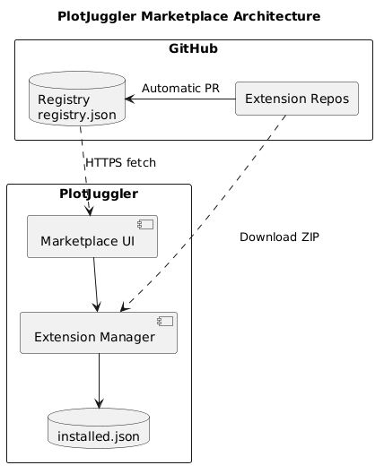
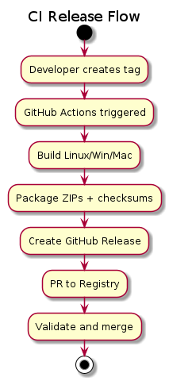
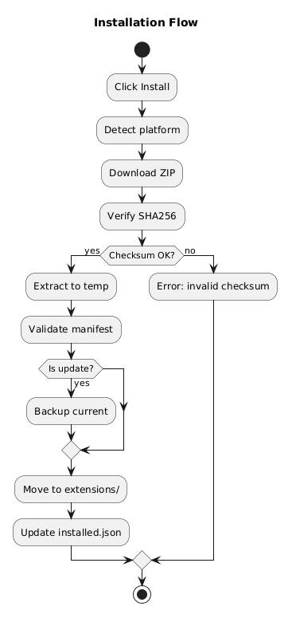
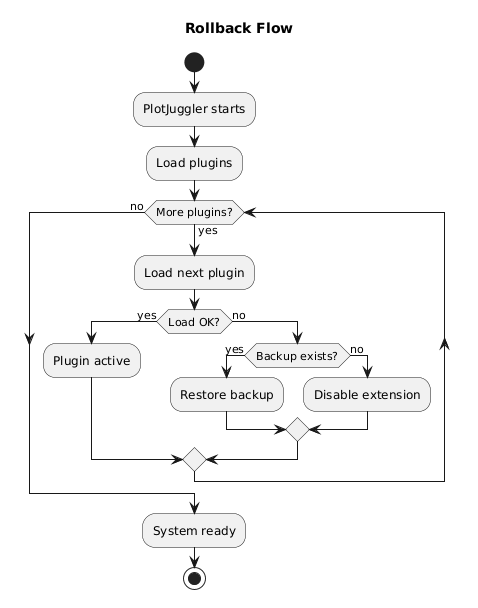
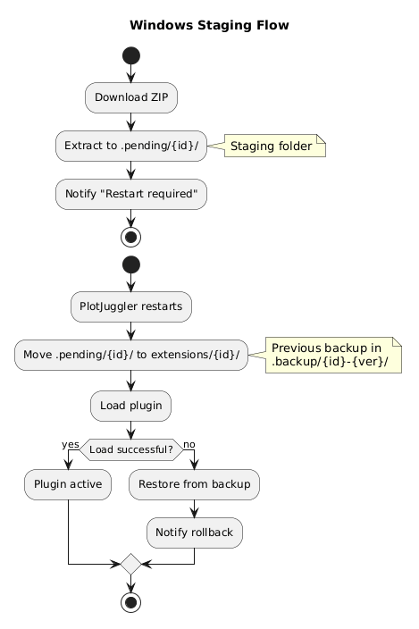

# PlotJuggler Marketplace — Technical Specification

> **Version:** 1.0.0
> **Date:** 2026-03-04
> **Revision:** First consolidated version of the specification document
> **Author:** Pablo Iñigo Blasco
> **Stack:** C++17, Qt 6 Widgets, CMake, Conan/Pixi

---

## Abstract

PlotJuggler has grown significantly over the past years, evolving from an internal tool to becoming a de facto standard for data visualization in robotics. With this growth comes a problem: **how do we allow the community to contribute plugins without requiring a full PlotJuggler recompilation for each update?**

The answer is the **PlotJuggler Marketplace**, an extension distribution system inspired by the VSCode model. The core idea is simple: a user opens the marketplace inside PlotJuggler, searches for "ROS 2", clicks "Install", and within seconds has the plugin running. No compilation, no dependency management, no worrying about Qt versions.

To achieve this, the system relies on a completely **serverless architecture**: no backend to maintain, no infrastructure costs. Everything lives on GitHub — a JSON file with the plugin catalog and binaries distributed as GitHub Releases. Plugin developers use a GitHub template that automates everything: they push a tag and the CI compiles for Linux, Windows and macOS, packages the binaries, and updates the catalog automatically.

The most interesting technical challenge is **ABI compatibility**. Historically, PlotJuggler plugins depended on Qt, which meant that a plugin compiled with Qt 5.15 wouldn't work with PlotJuggler compiled with Qt 6.2. The adopted solution is radical: **plugins no longer depend on Qt at all**. They define their UI through .ui files (pure XML) and use an abstract SDK for logic. PlotJuggler renders the UI and routes events. This eliminates the compatibility problem at its root.

Development will begin with a standalone prototype to validate the concept, with subsequent native integration into PlotJuggler 4.

---

## Table of Contents

1. [Feature List](#1-feature-list)
2. [Terminology](#2-terminology)
3. [System Architecture](#3-system-architecture)
4. [Design Decisions](#4-design-decisions)
5. [Registry — Format and Hosting](#5-registry--format-and-hosting)
6. [Extensions — Package Structure](#6-extensions--package-structure)
7. [Build System](#7-build-system)
8. [CI System](#8-ci-system)
9. [GitHub Template for Developers](#9-github-template-for-developers)
10. [Compatibility and ABI](#10-compatibility-and-abi)
11. [Windows Management](#11-windows-management)
12. [Graphical Interface](#12-graphical-interface)
13. [Code Structure](#13-code-structure)
14. [Functional Requirements](#14-functional-requirements)
15. [Non-Functional Requirements](#15-non-functional-requirements)
16. [Remaining Work](#16-remaining-work)
17. [Acceptance Criteria](#17-acceptance-criteria)

---

## 1. Feature List

### 1.1 Client Features (Marketplace UI)

| Category           | Feature              | Description                                                   |
| ------------------ | -------------------- | ------------------------------------------------------------- |
| **Discovery**      | Extension listing    | Display all available extensions in VSCode-style cards        |
|                    | Search               | Search by name, description, tags, and publisher              |
|                    | Category filtering   | Data Loader, Data Streamer, Parser, Toolbox                   |
|                    | Extension detail     | Panel with complete information, changelog, and dependencies  |
| **Installation**   | Secure download      | ZIP artifact download with SHA256 verification                |
|                    | Automatic extraction | Decompression to extensions directory                         |
|                    | Platform detection   | Automatic selection of correct artifact (Linux/Windows/macOS) |
| **Updates**        | Update detection     | Local vs registry version comparison (semver)                 |
|                    | Individual update    | Update a specific extension                                   |
|                    | Bulk update          | "Update All" for multiple extensions                          |
|                    | Automatic backup     | Backup of previous version before updating                    |
| **Uninstallation** | Clean removal        | Directory deletion + installed cache refresh                  |
|                    | Confirmation         | Confirmation dialog before uninstalling                       |
| **Management**     | Backup diagnostics   | Report retained backup paths when an update install fails     |
|                    | Persistent state     | Installed state derived from embedded plugin manifests        |
| **UI/UX**          | Download progress    | Progress bar in status bar                                    |
|                    | Notifications        | Status messages and available update alerts                   |
|                    | Context menu         | Quick actions per installed extension                         |

### 1.2 CI System Features (For Developers)

| Category       | Feature                    | Description                                                |
| -------------- | -------------------------- | ---------------------------------------------------------- |
| **Build**      | Cross-platform compilation | Matrix build for Linux, Windows, and macOS                 |
|                | Static linking             | All dependencies embedded in the artifact                  |
|                | Dependency management      | Support for Conan (current) and Pixi (future)              |
| **Packaging**  | ZIP generation             | Automatic packaging with plugin binaries and resources |
|                | Checksums                  | Automatic SHA256 generation per artifact                   |
|                | Versioning                 | Version extraction from git tag                            |
| **Publishing** | GitHub Release             | Automatic release creation with attached artifacts         |
|                | Registry update            | Automatic PR to registry repo with new version             |
| **Validation** | Unit tests                 | Test execution on each platform                            |
|                | Lint/Format                | Code style verification                                    |
|                | Schema validation          | Registry JSON validation in PRs                            |

### 1.3 Registry Features

| Category    | Feature             | Description                                           |
| ----------- | ------------------- | ----------------------------------------------------- |
| **Catalog** | Complete listing    | JSON with all available extensions                    |
|             | Metadata            | Name, description, author, license, tags, category    |
|             | Versioning          | Current version and minimum PlotJuggler versions      |
|             | Cross-platform      | URLs and checksums per platform (Linux/Windows/macOS) |
| **Hosting** | Static GitHub       | JSON file accessible via raw.githubusercontent.com    |
|             | Cache TTL           | Support for local cache with expiration time          |
|             | Multiple registries | Configuration for alternative registries (enterprise) |

---

## 2. Terminology

| Term           | Definition                                                                      |
| -------------- | ------------------------------------------------------------------------------- |
| **Extension**  | Marketplace distribution unit. Downloadable ZIP containing one or more plugins. |
| **Plugin**     | C++ module dynamically loaded (.so/.dll/.dylib) implementing an SDK interface.  |
| **Registry**   | Static JSON file on GitHub with the catalog of available extensions.            |
| **Plugin SDK** | Abstract library (no Qt) that plugins use for UI and data access.               |
| **Artifact**   | Compiled binary of an extension for a specific platform.                        |
| **Embedded manifest** | JSON string exported by each plugin DSO describing the installed plugin.  |

---

## 3. System Architecture

### 3.1 Overview

One of the first decisions was to avoid the complexity of maintaining a backend server. The key question was: *do we really need a server to distribute 30-50 plugins?* The answer is no.

GitHub provides everything we need for free:

- **Registry:** A simple JSON file in a repository. PlotJuggler downloads it via `raw.githubusercontent.com`, caches it locally, and that's it.
- **Artifacts:** Binaries are distributed as GitHub Releases. They're static URLs, with global CDN, no practical download limits.
- **Updates:** When a developer publishes a new version, their CI generates an automatic Pull Request to the registry repository. The schema is validated, URLs are verified, and it gets merged.

This architecture has an additional advantage: **any company can have their own private registry** simply by pointing PlotJuggler to another repository. No lock-in.

### 3.2 Component Diagram



### 3.3 Diagnostic propagation

`ExtensionManager` exposes its lifecycle events through three channels at once: a 50-entry ring buffer accessible via `diagnostics()`, the existing `diagnosticReported(QString id, QString message, bool is_error)` Qt signal, and an optional `PJ::DiagnosticSink` (declared in `pj_base/include/pj_base/diagnostic_sink.hpp`) that is fed in addition to the other two when the host passes one to the constructor. The sink is a `std::function<void(const PJ::Diagnostic&)>` carrying a level (Info / Warning / Error), a `source` ("ExtensionManager", "PluginRegistry", ...), an optional plugin/extension `id`, a message, and a timestamp. Hosts that wire the same sink into both `ExtensionManager` and any non-marketplace component (e.g. `PJ::PluginRuntimeCatalog`) see one unified, ordered diagnostic stream they can render in a status bar, dialog, or log file. Modules in pure C++ remain Qt-free; `PJ::QtDiagnosticBridge` in `pj_marketplace` converts each event into a queued signal emission.

### 3.4 Design Principles

The design is guided by several principles that emerged from previous experiences with plugin systems:

| Principle              | Why it matters                                                                                                                                                        |
| ---------------------- | --------------------------------------------------------------------------------------------------------------------------------------------------------------------- |
| **Serverless**         | Zero infrastructure costs, zero server maintenance. GitHub does the heavy lifting.                                                                                    |
| **CI-first**           | Developers shouldn't have to configure anything beyond using the template. Push a tag = automatic release.                                                            |
| **Cross-platform**     | PlotJuggler runs on Linux, Windows, and macOS. Plugins must work on all three platforms without developers needing all three machines.                                |
| **Static linking**     | A plugin is a single .so/.dll file that works without installing anything else. This drastically simplifies installation and avoids dependency conflicts.             |
| **Zero Qt in plugins** | This is perhaps the most important principle. If plugins depend on Qt, any Qt version change breaks all plugins. By removing Qt from plugins, the problem disappears. |
| **Dogfooding**         | Official plugins (ROS 2, MCAP, etc.) use exactly the same process as external contributors. This ensures the process works and is well documented.                    |

---

## 4. Design Decisions

### 4.1 PlotJuggler Integration

Two approaches were considered: create an external plugin management tool (like `pip` or `npm`) or integrate it directly into PlotJuggler. The decision was clear: **native integration**.

The reasoning is that the typical PlotJuggler user doesn't want to leave the application to install plugins. They want to open a window inside PlotJuggler, search for what they need, install it, and keep working. It's the VSCode experience, not managing packages from a terminal.

That said, development will begin with a **standalone prototype**. This allows rapid iteration without touching PlotJuggler's code, and validates that the concept works before committing to the architecture. Once validated, it will integrate as native functionality in PlotJuggler 4.

### 4.2 Plugin Template as Product

A key insight is that **the barrier to creating plugins is too high**. Configuring CMake, Conan, cross-platform CI... that's days of work before writing a single line of plugin code.

The solution is a **GitHub Template** that developers use as a starting point. They click "Use this template", clone the repo, and have:

- Preconfigured CI that compiles for Linux, Windows, and macOS
- Working Conan build system
- Project structure with examples
- Release workflow: creating a `v1.0.0` tag automatically triggers compilation, packaging, and publishing

The goal is that a developer with C++ experience can have their first plugin published in the marketplace **in a day**, not a week.

### 4.3 Build System: Conan, Pixi, and the Future

The C++ ecosystem has multiple dependency managers, and PlotJuggler has used several over time:

| Tool       | Status            | Context                                                                                                    |
| ---------- | ----------------- | ---------------------------------------------------------------------------------------------------------- |
| **CMake**  | Stable            | It's the de facto standard. No reason to change it.                                                        |
| **Conan**  | Active            | Works well, has good commercial support (JFrog), and the team has experience.                              |
| **Pixi**   | Under observation | It's gaining traction in the ROS community. Offers reproducible environments similar to conda but lighter. |
| **Colcon** | Abandoned         | Was necessary for ROS 1/2 integration, but added unnecessary complexity outside that context.              |

The current decision is to **use Conan for the plugin template**, but design the system so that generated artifacts are independent of the build tool. A ZIP with one or more plugin DSOs works the same whether it was generated with Conan, Pixi, or manual compilation; installed metadata is read from the embedded manifest exported by each DSO.

### 4.4 Pixi: A Future Bet

Pixi deserves special mention because it's gaining significant momentum in the ROS community. Its value proposition is attractive: reproducible environments, cross-platform, and without conda's historical problems.

The plan is:

1. **Short term:** Template uses Conan (already works, already tested)
2. **Medium term:** Add Pixi support as an alternative in the template
3. **Long term:** Evaluate if Pixi can replace Conan based on community adoption

The important thing is that this decision **doesn't affect marketplace users**. They just see plugins that install with one click.

### 4.5 Sizing

The system is designed for a modest catalog:

- **Current plugins:** ~20
- **Expected short-term:** ~30
- **Maximum estimate:** 40-50

This means a simple JSON file is more than sufficient as a registry. We don't need a database, we don't need sophisticated search. A JSON with 50 entries loads in milliseconds.

The four plugin families are:

- **Data Loader:** Loads data from files (CSV, MCAP, ROS bags...)
- **Data Streamer:** Real-time streaming (ROS 2, MQTT, ZMQ...)
- **Parser:** Converts byte blobs into structured fields
- **Toolbox:** Tools with their own UI (FFT, exporters, transformations...)

---

## 5. Registry — Format and Hosting

### 5.1 JSON Format

```json
{
  "registry_version": "1.0",
  "last_updated": "2026-03-04T10:00:00Z",
  "extensions": [
    {
      "id": "ros2-streaming",
      "name": "ROS 2 Streaming",
      "description": "Stream ROS 2 topics into PlotJuggler in real-time",
      "author": "Davide Faconti",
      "publisher": "PlotJuggler",
      "website": "https://github.com/plotjuggler/ros2-streaming",
      "repository": "https://github.com/plotjuggler/ros2-streaming",
      "license": "Apache-2.0",
      "icon_url": "https://raw.githubusercontent.com/.../icon.png",
      "category": "data_streamer",
      "tags": ["ros2", "streaming", "middleware", "robotics"],
      "version": "1.2.3",
      "min_plotjuggler_version": "4.0.0",
      "plugins": [
        {
          "name": "ROS2StreamerPlugin",
          "type": "data_streamer",
          "library": "libros2_streaming"
        }
      ],
      "platforms": {
        "linux-x86_64": {
          "url": "https://github.com/.../ros2-streaming-linux-x86_64.zip",
          "checksum": "sha256:a1b2c3d4e5f6...",
          "size_bytes": 2457600
        },
        "windows-x86_64": {
          "url": "https://github.com/.../ros2-streaming-windows-x86_64.zip",
          "checksum": "sha256:f6e5d4c3b2a1...",
          "size_bytes": 3145728
        },
        "macos-arm64": {
          "url": "https://github.com/.../ros2-streaming-macos-arm64.zip",
          "checksum": "sha256:1a2b3c4d5e6f...",
          "size_bytes": 2621440
        }
      },
      "changelog": {
        "1.2.3": "Fix reconnection timeout on network loss",
        "1.2.2": "Add QoS profile configuration",
        "1.2.0": "Initial marketplace release"
      }
    }
  ]
}
```

### 5.2 Extension Categories

| Category      | Value           | Description                                       |
| ------------- | --------------- | ------------------------------------------------- |
| Data Loader   | `data_loader`   | Loads data from files (atomic operation)          |
| Data Streamer | `data_streamer` | Continuous streaming at 50Hz, thread-safe         |
| Parser        | `parser`        | Conversion from byte blob to individual fields    |
| Toolbox       | `toolbox`       | Tools with GUI (FFT, CSV export, quaternion)      |
| Bundle        | `bundle`        | ZIP with multiple plugins from different families |

### 5.3 Registry Repository Structure

```
github.com/plotjuggler/marketplace-registry/
├── registry.json          ← Main catalog
├── icons/                 ← Extension icons (optional)
├── README.md
└── .github/
    └── workflows/
        └── validate.yml   ← Schema validation on each PR
```

**Access URL:** `https://raw.githubusercontent.com/plotjuggler/marketplace-registry/main/registry.json`

### 5.4 Local State

There is no local state JSON. `ExtensionManager` rebuilds its installed cache by
scanning `extensions/`, loading candidate plugin DSOs, and reading each DSO's
embedded manifest. The remote registry remains the pre-install catalog.

---

## 6. Extensions — Package Structure

### 6.1 ZIP Contents

```
ros2-streaming-linux-x86_64.zip
├── libros2_streaming.so       ← Compiled plugin(s)
├── ros2_streaming.ui          ← Qt Creator UI file (pure XML)
├── README.md                  ← Description (optional)
└── LICENSE                    ← License
```

### 6.2 Embedded Plugin Manifest

```cpp
PJ_DATA_SOURCE_PLUGIN(ROS2StreamerPlugin,
    R"({"id":"ros2-streaming","name":"ROS 2 Streaming","version":"1.2.3"})")
```

### 6.3 Compilation Requirements

- **Static linking:** All dependencies embedded in the binary
- **Zero Qt:** Plugin does NOT depend on Qt
- **SDK only:** Only dependency is the abstract Plugin SDK interface
- **.ui files:** Pure Qt Creator XML, not compiled

---

## 7. Build System

### 7.1 CMakeLists.txt (Template)

```cmake
cmake_minimum_required(VERSION 3.16)
project(my_extension VERSION 1.0.0 LANGUAGES CXX)

set(CMAKE_CXX_STANDARD 17)
set(CMAKE_CXX_STANDARD_REQUIRED ON)

find_package(plotjuggler_sdk REQUIRED)

add_library(my_plugin SHARED
    src/my_plugin.cpp
)

target_link_libraries(my_plugin PRIVATE
    plotjuggler::sdk
)

set_target_properties(my_plugin PROPERTIES
    PREFIX ""
    POSITION_INDEPENDENT_CODE ON
)

install(TARGETS my_plugin DESTINATION .)
install(FILES my_dialog.ui DESTINATION .)
install(FILES README.md LICENSE DESTINATION .)
```

### 7.2 conanfile.py (Template)

```python
from conan import ConanFile
from conan.tools.cmake import CMake, cmake_layout

class MyExtensionConan(ConanFile):
    name = "my-extension"
    version = "1.0.0"
    settings = "os", "compiler", "build_type", "arch"
    generators = "CMakeToolchain", "CMakeDeps"

    def requirements(self):
        self.requires("plotjuggler_sdk/4.0.0")

    def build(self):
        cmake = CMake(self)
        cmake.configure()
        cmake.build()

    def layout(self):
        cmake_layout(self)
```

### 7.3 Conan Profile for Static Linking

```ini
[settings]
os=Linux
compiler=gcc
compiler.version=13
compiler.libcxx=libstdc++11
build_type=Release
arch=x86_64

[options]
*:shared=False
*:fPIC=True
```

### 7.4 pixi.toml (Future)

```toml
[project]
name = "my-extension"
version = "1.0.0"
channels = ["conda-forge", "plotjuggler"]
platforms = ["linux-64", "win-64", "osx-arm64"]

[dependencies]
plotjuggler-sdk = ">=4.0"
cmake = ">=3.16"
ninja = "*"

[tasks]
build = "cmake --preset release && cmake --build --preset release"
test = "ctest --preset release"
package = "cmake --install build/release --prefix dist && cd dist && zip -r ../artifact.zip ."
```

---

## 8. CI System

### 8.1 Release Flow



1. Developer creates a tag (`git tag v1.2.3`)
2. GitHub Actions detects the tag and runs the release workflow
3. Compiles for all 3 platforms in parallel (matrix build)
4. Packages artifacts in ZIPs with plugin binaries and checksums
5. Creates a GitHub Release with attached artifacts
6. Generates an automatic PR to the registry with the new version
7. PR is automatically validated (schema, URLs, checksums)
8. If validation passes, auto-merge occurs

### 8.2 Installation Flow (Client)



1. User clicks "Install"
2. Current platform is verified
3. Corresponding ZIP is downloaded
4. SHA256 checksum is verified
5. If update on a non-staged platform, current version is backed up
6. Extracted to extensions directory
7. Plugin DSO is loaded and its embedded manifest is validated against the registry id/version
8. Installed cache is refreshed from discovery

When the marketplace opens inside a host application, it may be seeded with the host's
already-loaded plugin snapshot before the first render. That snapshot is initialization
data only; the embedded manifest remains the authority for installed version reporting.

### 8.3 Backup and Rollback Status



Every successful update — Linux, macOS, and Windows — moves the previous
version into `.backup/<id>-<oldversion>/` before the new version takes its
place. On Linux/macOS this happens synchronously inside `update()`. On
Windows it happens at restart inside `applyPendingInstalls()`, just before
the staged directory is renamed over the existing one; if the rename fails
after the backup, the marketplace attempts to roll the backup back into
place, and if that also fails the diagnostic surfaces both paths so the
user can recover manually.

Automatic *post-load* rollback (restoring from backup if the freshly
installed plugin later fails to load) is deferred. The backup directory
is the manual recovery point.

---

## 9. GitHub Template for Developers

### 9.1 Template Structure

```
plotjuggler/extension-template/
├── .github/
│   └── workflows/
│       ├── ci.yml                  ← Build + test on each push/PR
│       └── release.yml             ← Build + publish on tag
├── src/
│   ├── my_plugin.h
│   └── my_plugin.cpp
├── ui/
│   └── my_dialog.ui
├── test/
│   └── test_my_plugin.cpp
├── CMakeLists.txt
├── conanfile.py
├── pixi.toml                       ← Future alternative
├── conan_profiles/
│   ├── linux_static
│   ├── windows_static
│   └── macos_static
├── README.md
├── LICENSE
└── CLAUDE.md
```

### 9.2 CI Workflow (ci.yml)

```yaml
name: CI

on:
  push:
    branches: [main]
  pull_request:
    branches: [main]

jobs:
  build:
    strategy:
      matrix:
        include:
          - os: ubuntu-22.04
            profile: linux_static
          - os: windows-2022
            profile: windows_static
          - os: macos-14
            profile: macos_static

    runs-on: ${{ matrix.os }}

    steps:
      - uses: actions/checkout@v4
      - name: Install Conan
        run: pip install conan
      - name: Configure Conan
        run: |
          conan profile detect
          conan remote add plotjuggler https://conan.plotjuggler.io
      - name: Install dependencies
        run: conan install . --profile conan_profiles/${{ matrix.profile }} --build=missing
      - name: Build
        run: |
          cmake --preset conan-release
          cmake --build --preset conan-release
      - name: Test
        run: ctest --preset conan-release --output-on-failure
```

### 9.3 Release Workflow (release.yml)

The complete release workflow includes:

1. **build-artifacts:** Compile for all 3 platforms
2. **create-release:** Create GitHub Release with artifacts
3. **update-registry:** Generate PR to registry with checksums and URLs

---

## 10. Compatibility and ABI

### 10.1 The Compatibility Problem

Binary compatibility (ABI) is probably the biggest technical headache in any C++ plugin system. The typical scenario is:

1. User installs plugin compiled with Qt 5.15.2
2. User updates PlotJuggler to a version compiled with Qt 6.2
3. Plugin crashes because Qt's internal structures have changed

This problem has plagued PlotJuggler for years. Users report that "the ROS plugin stopped working after updating", and the only solution was to recompile the plugin.

### 10.2 The Solution: Zero Qt in Plugins

The adopted solution is radical but effective: **plugins no longer use Qt directly**.

Instead of plugins creating Qt widgets, they do two things:

1. **Define their UI in a .ui file:** It's pure XML, Qt Creator format. No compiled Qt code.
2. **Use an abstract SDK:** To read widget values, respond to events, etc.

When PlotJuggler loads the plugin:

1. It reads the .ui file and creates the corresponding widgets (using its version of Qt)
2. It connects those widget events to the plugin via the SDK
3. The plugin never touches Qt directly

This means a plugin compiled today will continue to work when PlotJuggler migrates to Qt 7, or Qt 8, or whatever comes next. The contract is the SDK, not Qt.

### 10.3 Compatibility Policy

The commitment to plugin developers:

- The registry declares `min_plotjuggler_version` for each extension
- If the SDK changes incompatibly, PlotJuggler provides an internal adapter
- **Existing plugins are never broken by PlotJuggler updates**
- Stability target: Qt LTS 6.8 (support until 2028)

---

## 11. Windows Management

### 11.1 The Windows Problem

Windows has an annoying quirk for plugin systems: **it doesn't allow modifying files that are in use**. If PlotJuggler has `ros2_streaming.dll` loaded, you can't delete it or overwrite it.

On Linux and macOS this isn't a problem — you can delete a file that's memory-mapped, and the process keeps using the old version until it closes. But Windows locks the file completely.

This means that on Windows, **you can't update a plugin while PlotJuggler is running**.

### 11.2 Solution: Staging

The solution is a staging system similar to what Windows installers use:



The flow is:

1. User clicks "Update"
2. New version downloads to a hidden transaction folder `.pj_install_<id>_<uuid>/` (created under `.extension_staging/` on Windows, under `extensions/` on Linux/macOS)
3. The staged DSO is loaded and its embedded manifest is validated against the registry id/version
4. A transient `.pj_pending_install` intent is written with the registry id/version
5. Message shown: "Update will be applied when PlotJuggler restarts"
6. When PlotJuggler starts:
   - Reads `.pj_pending_install`
   - Validates the intent's id/version against safe-path/regex rules (rejects path traversal or non-semver tokens)
   - Revalidates the staged DSO against that intent
   - Moves the new version from `.extension_staging/` to `extensions/`
   - Re-validates the DSO from its final location (catches rpath/dep issues that hold in staging but break in `extensions/`)
7. If any validation step fails the active install is left untouched. The broken stage is removed; if removal also fails (file lock), the directory is renamed to `.pj_quarantine_<name>_<uuid>/` and the path is included in the diagnostic so the user can clean it up manually instead of facing the same error every startup.

### 11.3 Directory Structure

The root is `QStandardPaths::GenericDataLocation` + `/plotjuggler` (Linux: `~/.local/share/plotjuggler/`, macOS: `~/Library/Application Support/plotjuggler/`, Windows: `%LOCALAPPDATA%/plotjuggler/`).

```
<config-root>/
├── extensions/              ← Active plugins
│   ├── ros2-streaming/
│   └── csv-loader/
├── .extension_staging/      ← Staging area (all platforms; Windows uses it for restart-time installs, Linux/macOS as the post-promotion validation gate)
│   └── plugin-id/
│       └── .pj_pending_install      ← Intent file (Windows-only)
└── .backup/                 ← Pre-update backups (all platforms); automatic rollback deferred — restore manually
    ├── ros2-streaming-1.2.2/
    └── csv-loader-0.9.0/
```

---

## 12. Graphical Interface

> **Note (2026-03-05 meeting):** Two UI approaches were discussed. For the POC/MVP, the simpler approach (12.1.A) is recommended. The VS Code-style panel layout (12.1.B) can be implemented in future iterations if needed.

### 12.1.A Simple List + Dialog (POC/MVP)

This approach prioritizes simplicity and fast implementation. Shown by Davide in the March 5th meeting.

```
┌─────────────────────────────────────────────────────────────┐
│  PlotJuggler Marketplace                              [X]   │
├─────────────────────────────────────────────────────────────┤
│ [Search...              ] [Category ▼] [Refresh]            │
├─────────────────────────────────────────────────────────────┤
│                                                              │
│   CanOpen parser           v1.0.0    [install]              │
│   Parquet parser           v2.1.0    [installed]            │
│   FFT Toolbox              v1.3.0    [installed]            │
│   CSV exporter             v1.0.0    [update] ⬆            │
│   ROS 2 Streaming          v3.0.0    [install]              │
│                                                              │
├─────────────────────────────────────────────────────────────┤
│  Status: Ready                              [████████] 100% │
└─────────────────────────────────────────────────────────────┘
```

**Interaction model:**
- **Mouseover** on item → Tooltip with brief description
- **Double-click** on item → Opens dialog with full details
- **Click on button** → Executes action (install/uninstall/update)

**Detail dialog (on double-click):**

```
┌───────────────────────────────────────┐
│  FFT Toolbox                    [X]   │
├───────────────────────────────────────┤
│  Version: 1.3.0                       │
│  Author: PlotJuggler Team             │
│  Category: toolbox                    │
│                                       │
│  Description:                         │
│  Fast Fourier Transform toolbox...    │
│                                       │
│  Changelog:                           │
│  v1.3.0 - Added Hamming window        │
│  v1.2.0 - Performance improvements    │
│                                       │
│  [View on GitHub]  [Close]            │
└───────────────────────────────────────┘
```

### 12.1.B VS Code-Style Panel Layout (Future)

This more elaborate approach can be implemented after the POC if a richer UX is desired.

```
┌──────────────────────────────────────────────────────────────────┐
│  [Toolbar]  ← Back │ Forward →  │  Search...  │  ⚙ Settings    │
├────────────────────┬─────────────────────────────────────────────┤
│                    │                                             │
│   SIDEBAR          │         DETAIL PANEL                       │
│   (Extension List) │         (Extension Info)                   │
│                    │                                             │
│  ┌──────────────┐  │  ┌─────────────────────────────────────┐   │
│  │ 🔍 Search    │  │  │  [Icon]  Extension Name    v1.2.3  │   │
│  │ Filter: All ▼│  │  │  by Publisher                       │   │
│  ├──────────────┤  │  │                                     │   │
│  │ INSTALLED(5) │  │  │  [Install] [Disable] [Uninstall]   │   │
│  │  Extension A │  │  ├─────────────────────────────────────┤   │
│  │  Extension B │  │  │  [Details] [Changelog] [Deps]       │   │
│  ├──────────────┤  │  │                                     │   │
│  │ AVAILABLE    │  │  │  Description content...             │   │
│  │  Extension C │  │  │                                     │   │
│  │  Extension D │  │  └─────────────────────────────────────┘   │
│  └──────────────┘  │                                             │
├────────────────────┴─────────────────────────────────────────────┤
│  Status Bar: "3 updates available" │ "Downloading..."           │
└──────────────────────────────────────────────────────────────────┘
```

### 12.2 Sidebar Components

**Extension Card:**

```
┌─────────────────────────────────────┐
│ [Icon]  Extension Name        [⚙]  │
│  32x32  by Publisher                │
│         Short description...        │
│         ⬇ 1.2K  ★★★★☆  v1.2.3     │
└─────────────────────────────────────┘
```

**Sections:**

1. INSTALLED — Installed extensions (with update badges)
2. AVAILABLE — Non-installed extensions
3. RECOMMENDED — Based on installed plugins (future)

**Filters:**

- Text search (name, description, tags)
- Category filter (Loader, Streamer, Parser, Toolbox)
- Quick filters: `@installed`, `@updates`

### 12.3 Extension Details

**For Approach A (dialog):**

The detail dialog shows:
- Name, version, author
- Category and tags
- Description text
- Changelog
- Link to repository

**For Approach B (panel):**

The detail panel includes:
- Icon (64x64)
- Name and publisher
- Metrics (downloads, rating)
- Action buttons (Install/Update/Uninstall)
- Metadata (category, tags, platforms, minimum version)
- Tabs: Details (README), Changelog, Dependencies

### 12.4 Management Controls

| State                       | Actions                    |
| --------------------------- | -------------------------- |
| Not installed               | Install                    |
| Installed, up-to-date       | Uninstall                  |
| Installed, update available | Update, Uninstall          |
| Installed, local newer      | Local newer, Uninstall     |

Enabling or disabling an installed extension without uninstalling it is **out
of scope** for the marketplace — it belongs to the host application's plugin
loader / config (e.g. a per-user knob in `pj_app` that filters which
discovered DSOs are instantiated at startup).

### 12.5 Dialogs

| Dialog            | Trigger             | Content                        |
| ----------------- | ------------------- | ------------------------------ |
| Confirm Install   | Click Install       | "Install {name} v{version}?"   |
| Confirm Uninstall | Click Uninstall     | "Remove {name}?"               |
| Restart Required  | Post install/update | "Restart to activate changes?" |
| Update All        | Multiple updates    | List of extensions to update   |
| Diagnostics       | Plugin/install fails | Recent lifecycle diagnostics   |

---

## 13. Code Structure

```
marketplace/
├── CMakeLists.txt
├── main.cpp
├── src/
│   ├── models/
│   │   ├── Extension.h
│   │   ├── InstalledExtension.h
│   │   ├── Registry.h
│   ├── core/
│   │   ├── RegistryManager.h/cpp
│   │   ├── ExtensionManager.h/cpp
│   │   ├── DownloadManager.h/cpp
│   │   └── PlatformUtils.h/cpp
│   ├── ui/
│   │   ├── MarketplaceWindow.h/cpp
│   │   └── ExtensionDetailDialog.h/cpp
└── resources/
    ├── icons/
    └── marketplace.qrc
```

---

## 14. Functional Requirements

### P0 — Minimum Viable

| ID   | Requirement                                         |
| ---- | --------------------------------------------------- |
| F-01 | Fetch and parse registry JSON from configurable URL |
| F-02 | List extensions in sidebar with cards               |
| F-03 | Search by name, description, tags                   |
| F-04 | Filter by category                                  |
| F-05 | Show selected extension detail                      |
| F-06 | Download ZIP with SHA256 verification               |
| F-07 | Extract ZIP to extensions directory                 |
| F-08 | Register installed extension from embedded DSO manifest |
| F-09 | Detect updates (local vs registry version)          |
| F-10 | Uninstall extension                                 |

### P1 — Robustness

| ID   | Requirement                         |
| ---- | ----------------------------------- |
| F-11 | Local registry cache with TTL       |
| F-12 | Backup previous version on updates  |
| F-13 | Automatic rollback if plugin fails (deferred) |
| F-14 | Windows staging: apply on restart   |
| F-16 | Cancel download in progress         |
| F-17 | Update All                          |
| F-18 | Confirmation dialogs                |

### P2 — Polish

| ID   | Requirement                         |
| ---- | ----------------------------------- |
| F-19 | Extension icons (download + cache)  |
| F-20 | Changelog per extension             |
| F-21 | Metrics (downloads, rating)         |
| F-22 | Notification: "N updates available" |
| F-23 | Multiple registry URLs              |

---

## 15. Non-Functional Requirements

| ID    | Requirement                                       |
| ----- | ------------------------------------------------- |
| NF-01 | C++17 minimum                                     |
| NF-02 | Qt 6.x Widgets (LTS 6.8 target)                   |
| NF-03 | Cross-platform: Linux, Windows, macOS             |
| NF-04 | Build system: CMake                               |
| NF-05 | Dependencies: Conan (current), Pixi (future)      |
| NF-06 | No external dependencies beyond Qt                |
| NF-07 | Standalone → integrable into PlotJuggler          |
| NF-08 | Download in background thread                     |
| NF-09 | Registry of ~50 extensions: <100ms to load/filter |
| NF-10 | Static linking in extensions                      |

---

## 16. Remaining Work

Open follow-ups are tracked in [TODO.md](TODO.md).

---

## 17. Acceptance Criteria

The prototype is successful if:

1. Opens as standalone Qt Widgets app
2. Loads registry JSON from URL (GitHub raw)
3. Shows extension list with cards
4. Allows searching and filtering by category
5. Shows selected extension detail
6. Downloads ZIP with checksum verification
7. Extracts to local directory and registers as installed
8. Detects new available versions
9. Allows extension uninstallation
10. Works on Linux (Windows/macOS as stretch goal)
